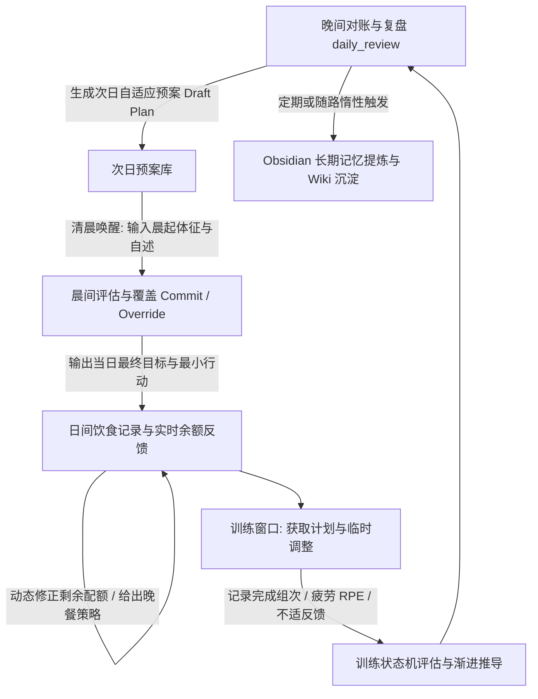
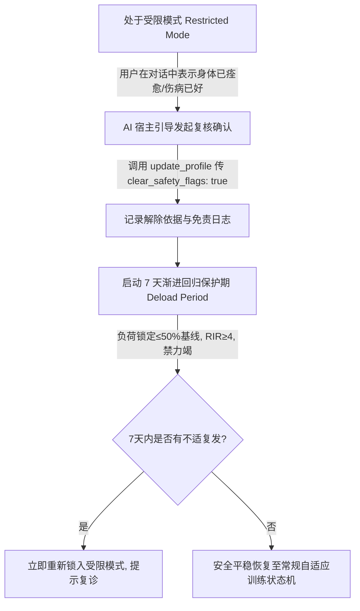

# CYBER HEALTH AGENT 产品与技术规格说明书
### 面向 OpenClaw、Hermes 与其他 AI 宿主的可插拔健康 Agent 插件

* **文档版本**：v1.1（全闭环产品 / 技术设计基线）
* **定位**：MCP / Tool 接口驱动的健康领域确定性计算与业务状态服务
* **核心依赖**：独立的 Obsidian Memory 插件（默认 MemoryProvider；长期记忆能力可替换实现）
* **交互形态**：纯 AI 对话交互（任意新建会话、跨会话状态保持、无独立 UI App 负担）
* **适用对象**：产品、架构、后端、Agent / MCP、算法与测试团队
* **设计主张**：AI 宿主负责交互、理解与推理；Cyber Health 负责健康状态、确定性计算、策略与领域规则；通用记忆由独立 Obsidian 插件管理。更换 AI 模型或新建对话，不迁移或丢失任何健康事实。
* **基线日期**：2026 年 9 月

---

## 目录
1. [文档目的、范围与成功标准](#1-文档目的范围与成功标准)
2. [产品定位与设计原则](#2-产品定位与设计原则)
3. [用户体验与核心闭环](#3-用户体验与核心闭环)
4. [功能需求：营养、训练、复盘与计划](#4-功能需求营养训练复盘与计划)
5. [系统架构与插件边界](#5-系统架构与插件边界)
6. [记忆生命周期与 Obsidian Memory 集成](#6-记忆生命周期与-obsidian-memory-集成)
7. [循证知识系统与安全边界（含受限模式恢复协议）](#7-循证知识系统与安全边界)
8. [数据模型与存储策略](#8-数据模型与存储策略)
9. [MCP / Tool API 规范（全闭环定义）](#9-mcp--tool-api-规范)
10. [调度、提醒与宿主适配](#10-调度提醒与宿主适配)
11. [隐私、安全与可控性](#11-隐私安全与可控性)
12. [MVP 范围、验收与路线图](#12-mvp-范围验收与路线图)
13. [核心契约与宿主适配](#13-核心契约与宿主适配)
14. [可靠性、审计与运维](#14-可靠性审计与运维)
15. [单机一致性、修订与迁移](#15-单机一致性修订与迁移)
16. [OpenClaw 首个适配规范](#16-openclaw-首个适配规范)
17. [附录 A. 关键业务规则与示例](#附录-a-关键业务规则与示例)

---

## 1. 文档目的、范围与成功标准

本说明书定义 Cyber Health Agent 的产品需求、技术架构与交付边界。目标是把营养跟踪、训练指导、每日复盘和次日适应计划封装为独立、可持久化的健康插件；任何支持 MCP 或等价工具接口的 AI 宿主（如 OpenClaw、Hermes 等）均可调用。

### 1.1 解决的问题
1. **跨会话持久性与宿主解耦**：用户会随时新建聊天会话或更换底层模型；健康数据、体征账本与训练进度绝不能跟随特定会话窗口丢失。
2. **拒绝大模型计算幻觉与假精确**：营养热量与负荷计算不能依赖大模型的算术推理；饭菜照片估算存在固有不确定性，系统必须以区间、置信度和澄清/修正机制提供反馈。
3. **多维健康协同闭环**：饮食、训练、睡眠与疲劳互相交织；单纯的“记卡路里”无法形成现实的日常闭环。
4. **记忆分层与可审计性**：流水账短期可用后自动压缩；高价值的个人身体规律沉淀至用户的 Obsidian Vault 中，形成带双向链接的白盒健康档案。

### 1.2 范围定义
| 纳入本期规格 (v1.1) | 明确不在本期承诺 |
| :--- | :--- |
| 个体建档、目标管理、日计划（预案与执行版确认） | 医疗诊断、处方开具、急救建议或替代专科医疗服务 |
| 拍照/文字食物解析后的热量与宏量区间估算、纠错、快捷复用 | 将图像估算伪装成绝对精确的生化化验结果 |
| 晨起体征与主观状态录入（体重、睡眠、疲劳、酸痛、步数） | 不经用户审核的高风险、极端训练或超低热量节食方案 |
| 训练处方、日志、疲劳自适应调整、渐进超负荷与受限模式恢复 | 强制开发独立原生 App 界面（交互 100% 依托 AI 对话） |
| 独立本地 MCP 服务、SQLite 运行时事实库、Obsidian Memory Provider 适配 | 将通用记忆机制或第三方商业云平台强行硬编码绑定 |

### 1.3 成功标准
* **可移植性**：同一用户在 OpenClaw、Hermes 或测试客户端中无论新建多少会话，调用 `cyber_health_get_today` 均获得完全一致的健康状态。
* **全对话闭环性**：用户在聊天中无论是发就餐图、随口报体重、反馈昨晚失眠、指出刚才少吃了半碗饭，还是在健身房临时换器械，AI 均有对应 MCP 工具落地闭环，无断头路。
* **自适应性**：晚间复盘根据实际摄入、训练、睡眠、疲劳状态，生成温和的次日预案；早晨根据实际体征完成最终确认或快速降载。
* **可解释与纠错**：所有估算均带来源、置信度与区间；用户任何纠错均保留修正链并即时平账。
* **可恢复记录**：用户主动提交的健康图片及其确认后的分析结果，与对应训练或饮食事实一并本地保存，保证换会话后可核对；视觉推理中间过程不保存。短期细节（14–30天）到期压缩；个人长期规律受控晋升至 Obsidian Wiki。

---

## 2. 产品定位与设计原则

Cyber Health 是**“健康领域确定性能力插件”**，而不是绑定在某个聊天客户端里的 System Prompt。AI Host 充当与用户对话的“耳朵和嘴巴”；Cyber Health 充当后台的“专业教练大脑、严谨算盘与安全卫士”。

| 原则 | 工程与对话含义 |
| :--- | :--- |
| **宿主可替换** | 业务状态与核心逻辑完全封装在 Cyber Health 插件中；严禁将任何关键健康状态仅保留在 LLM 临时上下文内。 |
| **事实优先** | 用户明确输入 > 设备数据 > 历史记录 > AI 推断 > 系统默认值。推断绝不能覆盖用户的明确澄清。 |
| **区间优先** | 热量、份量、烹饪油量等不确定数据一律返回估计区间与置信度，不向用户输出虚假的单点精确数字。 |
| **渐进适应** | 单日偏差仅做温和修补；禁止使用“今天吃多了明天扣掉等额热量”或“以过量运动惩罚进食”的有害补偿叙事；7–14 天趋势才触发强调整。 |
| **最小留存** | 存结构化事实，不存冗余对话；用户主动提交、能支撑健康事实核对的原始图片与最终分析可随该事实本地保存；不保存视觉推理中间态。 |
| **本地优先与白盒记忆** | 数据默认保存在用户本地 SQLite 中；长期认知交由本地 Obsidian Markdown 笔记管理，支持用户随时查看、搜索和双向链接。 |

> **🌟 北极星体验**：用户在微信、飞书或任何聊天软件里随手给 AI 发一张午餐照片、说一句“今天跑了5公里但膝盖有点酸”，AI 都能在不苛求完美记录的前提下，给出当下可落地的下一步建议，并在数周后通过 Obsidian 总结出“更适合你个人的体质规律”。

---

## 3. 用户体验与核心闭环

### 3.1 初次建档（Onboarding）
Onboarding 必须先收集足够形成安全基线的信息；允许在对话中分阶段自然补充，不得因缺失非必要字段阻断交互。

* **P0 基础档案**：年龄段、性别、身高、体重、当前核心目标（减脂 / 增肌 / 维持 / 体能表现）。
* **饮食与风险**：过敏原、忌口偏好、常见就餐场景（外卖/食堂/自做）、遵医嘱限制或慢性病史。
* **作息与可用性**：平日与周末作息、每周可训练天数、单次可用时长、习惯训练时段。
* **训练基础**：运动经验分级、可用器械场地（健身房/家庭哑铃/纯自重）、既往伤病史。

---

### 3.2 每日核心体验闭环（时序自适应流转）

每日闭环采用**“晚间预案（Draft） $\rightarrow$ 晨间确认（Commit / Override） $\rightarrow$ 日间动态平衡 $\rightarrow$ 训练执行 $\rightarrow$ 晚间对账”**的螺旋演进机制：



1. **早晨（晨间确认与覆盖）**：
   * 宿主唤醒或用户主动发起对话：“*早啊，称了下 71.8kg，昨晚失眠只睡了5小时*”。
   * 宿主调用 `cyber_health_log_daily_metrics` 录入体征；
   * 调用 `cyber_health_get_today` 或 `cyber_health_plan_tomorrow`，根据实际睡眠与晨起疲劳对昨晚的预案进行确认或降载覆盖（例如：将高负荷深蹲日降级为中低强度恢复或技术动作）。
2. **白天（摄入与余额对账）**：
   * 用户随手发图、语音或快捷输入（“午餐同昨天”）；
   * 插件即时返回：本餐估计区间、全天累计、剩余蛋白质/热量缺口，以及下一餐的落地建议。
3. **训练前后（处方指引与反馈）**：
   * 训练前：调用 `cyber_health_get_training_plan`，返回动作、组数、次数区间、目标负荷、RPE/RIR 指引及热身方案；
   * 训练后：调用 `cyber_health_log_workout`，记录实际完成情况、主观疲劳（RPE）和任何局部酸痛/不适。
4. **晚上（事实对账与生成明日预案）**：
   * 睡前对话：调用 `cyber_health_daily_review`，将全天事实与目标对比，客观归因偏差（非指责叙事）；
   * 输出明日预案（`Draft Plan`）和一个最核心的行动建议。
5. **记忆提炼（跨会话沉淀）**：
   * 在晚间复盘或启动时，随路执行即将到期数据的清理与候选记忆（Candidate）提炼，经用户确认后沉淀为 Obsidian 长期双向链接。

---

### 3.3 饮食交互：识别、纠错、快捷复用与余额反馈

| 交互场景 | 对话输入示例 | 系统处理机制与 MCP 调用 |
| :--- | :--- | :--- |
| **正常识别（高置信）** | 用户发送轻食沙拉与鸡胸肉图片 | 宿主提取结构化食材，调用 `cyber_health_log_meal`；返回区间与全天剩余配额。 |
| **不确定性（中/低置信）** | “吃了一份炒牛河，打包回来的” | 标记烹饪油量与份量不确定，返回区间（如 650–850 kcal）并附带 1–2 个澄清问题（“油多吗？吃完了吗？”）。 |
| **快捷复用** | “早餐跟昨天一模一样” | 传入 `repeat_yesterday_meal: "breakfast"`，插件自动从历史记录复制并刷新全天余额。 |
| **事后纠错/修改** | “刚才那碗面其实只吃了一半，汤没喝” | 传入 `target_meal_id` 重新调用 `log_meal`；系统保留修正链并实时扣减已记卡路里。 |
| **记重作废/撤销** | “刚才记重了，帮我把那杯奶茶删掉” | 调用 `cyber_health_delete_meal`，软删除记录并平账。 |
| **午间超标应对** | “中午聚餐吃撑了，热量严重超标” | 触发 `NUTRITION_ADAPT_01`：不宣扬内疚，严禁建议断食；晚餐建议优先保证 40g 优质蛋白质、足量绿叶蔬菜，极低烹饪油，适度控制碳水。 |

---

## 4. 功能需求：营养、训练、复盘与计划

### 4.1 营养引擎
* **区间输出**：按用户目标输出热量与宏量配额（区分高消耗训练日、轻度恢复日和休息日）。
* **全生命周期餐食管理**：支持结构化新增、引用复用、修改微调（`target_meal_id`）与作废删除（`delete_meal`）。
* **多渠道校准**：支持用户针对个人高频食物（如“妈妈包的饺子”、“公司食堂快餐”）进行自定校准，记录置信度与证据次数。

### 4.2 训练教练
* **个性化处方生成**：根据可用器械（如“只有一副各 10kg 哑铃”）、时间约束和当日状态，生成包含目标组次、建议负荷、休息时长与 RPE 指引的动作清单。
* **临场替换容错**：在健身房器械被占或局部微感不适时，支持同动模式动作快捷替换（如杠铃卧推换哑铃卧推，深蹲换高脚杯深蹲），不破坏周总容量。
* **疲劳与渐进状态机**：
  ```
  计划动作 → 已执行并反馈（完成率 + RPE + 疲劳）
      ↓
      ├── 达标且恢复良好（连续 2 次达到次数上限且 RPE≤8） → 提议小幅加重/加次（需用户确认）
      ├── 表现平稳 / 疲劳度中等 → 维持原负荷继续巩固
      └── 表现未达标 / 明显疲劳 / 睡眠严重不足 → 触发 TRAIN_RECOVERY 自动降载或改为拉伸
  ```

### 4.3 计划层：预案与执行版双态管理
* **每日计划双态（Draft vs Committed）**：
  * **晚间预案（Draft）**：基于当日复盘初步规划次日动作与餐次重心；
  * **晨间执行版（Committed）**：在用户早晨唤醒汇报睡眠与晨重后，正式锁定为今日基准。
* **最低可完成版本（Minimum Effective Plan）**：每个训练计划均附带 10–15 分钟的“极简应急版”（如时间紧张时保留 2 个复合核心动作各做 2 组），降低断卡负罪感。

---

## 5. 系统架构与插件边界

```
┌────────────────────────────────────────────────────────┐
│  AI Host 交互层（OpenClaw / Hermes / 微信/飞书/终端宿主） │
│  职责：自然语言理解、图像解析、多轮对话引导、定时唤醒调度 │
└───────────────────────────┬────────────────────────────┘
                            │ 标准 MCP 协议 (stdio / HTTP)
┌───────────────────────────▼────────────────────────────┐
│  Cyber Health Plugin (MCP 服务端)                      │
│  ├─ Core: 用户上下文、状态机引擎、幂等与审计层          │
│  ├─ Nutrition Engine: 营养计算、区间推导、纠错平账     │
│  ├─ Training Coach: 训练模板、负荷渐进、恢复降载       │
│  ├─ Planner & Reviewer: 预案/晨间覆盖、全天对账归因     │
│  ├─ Knowledge Pack: 版本化循证库与安全红旗监测         │
│  └─ Adapter: SQLite 事实仓储 & Obsidian Memory 适配器  │
└───────┬───────────────────┬───────────────────┬────────┘
        │                   │                   │
┌───────▼────────┐  ┌───────▼─────────┐ ┌───────▼────────┐
│ 本地 SQLite 库 │  │ Obsidian Memory │ │ 循证医学知识包 │
│ (事实流水/账本)│  │ (长期Wiki/档案) │ │ (内置安全护栏) │
└────────────────┘  └─────────────────┘ └────────────────┘
```

| 模块名称 | 核心职责 | 绝对不得越界做的事情 |
| :--- | :--- | :--- |
| **AI Host** | 自然语言解析、视觉模型识别、多轮澄清提问、定时器任务触发。 | 私自持有唯一的健康业务状态；越过插件进行卡路里数学计算。 |
| **Cyber Health** | 确定性状态机、加减法对账、负荷建议、规则审计、安全护栏。 | 强依赖特定聊天工具；直接硬编码写入未经抽象的私有云端。 |
| **Obsidian Memory** | 提供短期带 TTL 记忆、候选 Inbox、冻结 Raw 与白盒 Wiki。 | 包含具体的营养学计算公式或训练处方算法。 |
| **本地 SQLite** | 高频、高一致性事务事实（餐食、组次、体征、计划版本）。 | 充当用户可直接阅读的长期认知笔记系统。 |

---

## 6. 记忆生命周期与 Obsidian Memory 集成

严格遵循 Obsidian Memory 的生命周期流转，结合健康领域特性进行沉淀与清理：

```
EPHEMERAL（单次会话推理）
   原始食物照片、多模态视觉中间解析推理 → 记录完成后立即释放
         ↓
SHORT_TERM（近期确定性事实，带 TTL）
   每顿餐食细节（14–30天）、训练组次负荷（30–90天）、每日复盘文本（30–60天）
         ↓ 到期压缩归纳（周/月度趋势）
CANDIDATE（提炼候选，沉淀进 Inbox）
   重复出现的饮食不耐受、动作代偿倾向、作息相关性等（需满足证据阈值）
         ↓ 用户明确确认 / 人工审核
RAW → WIKI（稳定的个人长期健康档案）
   最终沉淀在 Obsidian Vault 中，如 [[乳清蛋白消化不良.md]]、[[深蹲代偿记录.md]]
```

### 6.1 本地单机休眠环境下的记忆维护机制
* **只读检查 + 宿主显式执行**：
  1. `cyber_health_get_today` 和 `daily_review` 只读计算到期工作，返回 `maintenance_recommended`、原因、稳定维护键和建议动作，不在查询内写库或启动后台线程；
  2. 宿主看到维护提示后显式调用 `cyber_health_maintain_memory`，以幂等、可续跑的方式处理 outbox、过期租约和 TTL 数据；
  3. 设备休眠期间不需要常驻守护进程；下次宿主唤醒时通过同一只读检查恢复待办工作。
* **白盒可查性**：生成的长期 Wiki 笔记保存在 Obsidian 项目的 `wiki/` 目录下，所有笔记包含双向链接（如关联到 `[[减脂执行策略]]`、`[[力量渐进周报]]`），用户可直接使用 Obsidian 打开查看和编辑。

### 6.2 Obsidian Memory 对接边界

Obsidian Memory 是长期个体化记忆的核心依赖。`obsidian-memory-plugin` 是 hook-only 宿主扩展，负责加载 Skill、注入规则和暴露连接配置，不是 MCP 服务或可调用 Provider。Cyber Health 只通过 `MemoryProvider` 边界访问长期记忆；当安装/更新预检查验证 Vault 与 `health-manager` 项目后，`ObsidianMemoryProvider` 才在该受限项目内执行 query/propose/action。Raw/Candidate/Wiki 生命周期仍遵循 Obsidian Memory Skill，Core 不越过 Provider 直接操作 Vault。

记忆分层职责如下：

```text
SQLite：短期事实与运行状态（餐食、体征、训练、计划、修正链）
Obsidian Memory：长期个人规律与用户投放资料的可检索记忆
```

每次健康记忆查询默认同时查询两层，而不是命中一层后停止：

```text
SQLite 短期事实 + Obsidian 长期记忆
          ↓
统一返回内容、时间、来源、置信度、确认状态
          ↓
AI 判断一致、补充或冲突并形成回答
```

Cyber Health 负责提供带证据的上下文，AI 负责语义冲突判断；长期记忆的新增、修改或撤销仍通过 Obsidian Memory 的用户确认流程完成。胸痛、晕厥等安全红旗属于确定性安全规则，优先级高于两层记忆及 AI 判断。

Obsidian Memory 暂时不可用时，SQLite 侧的记餐、训练、计划和安全规则继续运行；长期记忆写入或查询标记为待重试，不得阻断核心业务事务。

---

## 7. 循证知识系统与安全边界

### 7.1 安全护栏（红旗机制）
* **绝对红旗**：出现胸痛、严重胸闷、呼吸困难、运动中眩晕、黑朦、急性剧烈关节刺痛等情况，系统**强制立即阻断所有训练处方生成**，返回 `SAFETY_ESCALATION` 与急救/就医指导。
* **相对红旗**：孕期、急性胃肠炎、感冒发热、进食障碍倾向，系统自动转入**受限模式（Restricted Mode）**：仅提供低风险、维持性营养与水分补充建议。

### 7.2 受限模式退出与渐进回归协议（Return-to-Play Protocol）
系统进入受限模式后，退出必须形成**“用户主动发起 $\rightarrow$ 确认免责声明 $\rightarrow$ 强制降载保护期”**的完整闭环：



1. **触发方式**：用户在对话中说明身体已康复，AI 宿主调用 `cyber_health_update_profile` 并传入：
   ```json
   {
     "clear_safety_flags": true,
     "clearance_reason": "膝盖急性滑膜炎已消退，医生复诊允许恢复轻度运动"
   }
   ```
2. **强制过渡保护（Deload Period）**：
   * 退出受限模式后的首个训练周期（7 天内），系统强制锁定在低强度模式；
   * 工作重量上限不得超过发病前基线的 50%–60%，RIR 必须 $\ge 3$；
   * 7 天内每日复盘重点追踪该部位反馈，无异常后方可逐步恢复渐进超负荷。

---

## 8. 数据模型与存储策略

本地 SQLite 事实数据库核心表结构：

| 数据实体 | 关键字段定义 | 存储周期与策略 |
| :--- | :--- | :--- |
| **UserProfile** | `user_id`, `goals`, `constraints`, `safety_flags`, `timezone`, `state_version` | 长期持久化；支持用户查看、编辑与删除 |
| **DailyState** | `date`, `weight_kg`, `sleep_hours`, `sleep_quality`, `fatigue`, `soreness`, `steps`, `status_mode`, `recording_status` | 当日活跃，7–14天供趋势查询；派生字段随时可由事实重算 |
| **MealLog** | `meal_id`, `date`, `meal_type`, `foods_json`, `kcal_range`, `protein_range`, `confidence`, `status`('active'/'superseded'/'deleted'), `parent_meal_id`, `causation_id`, `state_version` | 详细数据保留 14–30 天；到期压缩为营养周均值并清理食材明细 |
| **WorkoutLog** | `session_id`, `date`, `planned_exercises`, `actual_sets_json`, `rpe_avg`, `discomfort_notes`, `completion_rate` | 详细数据保留 30–90 天；到期压缩为动作负荷走势 |
| **Plan** | `plan_id`, `date`, `state`('draft'/'committed'), `nutrition_targets`, `workout_plan`, `minimum_plan` | 预案/执行版记录；保留 30 天 |
| **DailyReview** | `review_id`, `date`, `summary_md`, `deviations_json`, `action_item`, `tomorrow_draft_id` | 保留 60 天；供周报与趋势提炼使用 |
| **ScheduleEvent**| `event_id`, `date`, `event_type`, `window_start`, `window_end`, `priority`, `status`, `revision`, `delivery_attempts` | 当日有效；供宿主拉取注册定时器与补偿处理 |
| **OperationLog** | `operation_id`, `idempotency_key`, `request_hash`, `result_status`, `before_version`, `after_version`, `error_code` | 审计与幂等去重；按隐私策略保留 |

---

## 9. MCP / Tool API 规范

所有工具均具备**结构化入参、确定性输出、严格字段级校验与幂等性保证**。

### 9.1 工具总览清单（全闭环核心接口）

| 分类 | 工具名称 | 核心用途与对话场景 | 关键返回字段 |
| :--- | :--- | :--- | :--- |
| **档案与体征** | `cyber_health_get_profile` | 读取用户档案、健康目标、伤病限制与安全模式。 | `profile`, `goals`, `constraints`, `safety_flags` |
| | `cyber_health_update_profile` | 更新资料、修改目标或申请解除安全受限模式。 | `updated_fields`, `safety_mode`, `version` |
| | **`cyber_health_log_daily_metrics`**<br>*(v1.1新增)* | **对话录入晨起/日常体征（体重、睡眠、疲劳、酸痛、步数）。** | `recorded_metrics`, `recovery_evaluation`, `alerts` |
| **日间状态** | `cyber_health_get_today` | 获取今日热量/蛋白质账本、执行版计划与实时状态。 | `targets`, `consumed`, `remaining`, `plan_status` |
| **营养对账** | `cyber_health_log_meal` | 记录餐食；支持传入 `target_meal_id` 修正旧餐食，或传 `repeat_meal` 快捷复用。 | `meal_id`, `today_totals`, `remaining`, `coaching_tip` |
| | **`cyber_health_delete_meal`**<br>*(v1.1新增)* | **撤销/作废某次记重的餐食记录并自动重新平账。** | `deleted_meal_id`, `recalculated_totals`, `remaining` |
| | `cyber_health_get_remaining_calories` | 针对当前剩余配额，查询下一餐的营养推荐策略。 | `remaining_ranges`, `priority_nutrients`, `suggestion` |
| **训练指导** | `cyber_health_get_training_plan` | 获取今日训练计划（含标准版与最低可完成版）。 | `session`, `exercises`, `minimum_plan`, `safety_notes` |
| | `cyber_health_log_workout` | 记录训练组次、负荷、RPE 与酸痛反馈，触发渐进状态机。 | `completion_rate`, `progression_advice`, `recovery_state` |
| | `cyber_health_complete_workout` | 极简打卡（适于用户只说“练完了”而未提供明细）。 | `status`, `missing_fields_prompt`, `next_action` |
| | `cyber_health_confirm_training_progression` | 用户确认带证据签名的加重或加次建议，并在事务内重新校验安全状态。 | `proposal_id`, `source_record_ids`, `state_version` |
| | `cyber_health_substitute_exercise` | 根据器械与不适保持动作模式的安全替换。 | `original_exercise`, `substitutions`, `safety_notes` |
| **复盘与计划** | `cyber_health_daily_review` | 晚间对账复盘，输出偏差归因与次日自适应预案（Draft）。 | `summary`, `causes`, `tomorrow_draft_plan`, `action_item` |
| | `cyber_health_plan_tomorrow` | 早晨或需要时生成/刷新次日或今日计划。 | `nutrition_plan`, `training_plan`, `commit_status` |
| **调度与维护** | **`cyber_health_get_schedule`**<br>*(v1.1新增)* | **供宿主拉取今日待提醒事件清单与动态时间窗口。** | `events: [{event_type, window_start, window_end, hint}]` |
| | `cyber_health_schedule_daily_reminders` | 生成稳定的每日提醒事件，供宿主进行调度对账。 | `events`, `state_version` |
| | `cyber_health_update_schedule_event` | 更新事件状态、送达结果或延后时间窗口。 | `event_id`, `status`, `revision` |
| | `cyber_health_acknowledge_schedule_event` | 确认或跳过调度事件，避免重复触发。 | `event_id`, `status`, `revision` |
| | **`cyber_health_maintain_memory`**<br>*(v1.1新增)* | **由宿主根据只读维护提示显式执行到期压缩、归纳与 outbox 续跑。** | `pruned_records`, `consolidated_trends`, `new_candidates` |
| **认知与审计** | `cyber_health_memory_action` | 提议/确认将健康规律记入或删除于 Obsidian Vault。 | `candidate_id`, `status`, `target_note_path` |
| | `cyber_health_query_memory` | 同时查询 SQLite 短期事实与经确认的长期记忆。 | `short_term_facts`, `obsidian_memories`, `warnings` |
| | `cyber_health_get_memory_suggestions` | 只读发现跨日重复模式，返回需用户确认的候选。 | `suggestions`, `candidate_key`, `requires_user_confirmation` |
| | `cyber_health_query_knowledge` | 查询专业循证知识包（附带证据等级与适用边界）。 | `answer`, `sources`, `limitations`, `disclaimer` |
| | `cyber_health_get_audit_trail` | 查询事实修订、平账与操作因果链。 | `operations`, `before_version`, `after_version`, `causation_id` |
| | `cyber_health_health_check` | 检查事实库、记忆提供者与待重试工作。 | `components`, `pending_work`, `overall_status` |
| | `cyber_health_export_data` | 导出可迁移的用户事实与 schema 元数据。 | `format`, `export_version`, `artifact_path` |
| | `cyber_health_import_data` | 在严格 schema 验证和原子回滚保护下导入事实快照。 | `imported_counts`, `state_version`, `warnings` |

---

### 9.2 MemoryProvider 对接接口

Cyber Health Core 不直接访问 Vault 文件系统，而是调用可替换的 `MemoryProvider`。当连接通过安装/更新预检查后，`ObsidianMemoryProvider` 将以下领域无关操作限定到已配置的 `health-manager` 项目；`obsidian-memory-plugin` 只负责宿主端 Skill 与配置接入：

| Provider 操作 | 用途 | 关键约束 |
| :--- | :--- | :--- |
| `memory.query` | 查询长期记忆及用户投放资料 | 返回内容、来源、时间、置信度、确认状态和证据引用 |
| `memory.propose` | 提交由短期事实提炼出的候选规律 | 不得直接写入已确认 Wiki |
| `memory.action` | 确认、拒绝、更新或撤销候选/长期记忆 | 由用户确认结果驱动，保留版本链 |
| `memory.maintain` | 请求执行到期整理或待重试写入 | 具体扫描、解析和重试逻辑由 Provider 实现 |

`memory.query` 的默认语义是同时查询 SQLite 短期事实与 Obsidian 长期记忆，并将两层结果连同 `source_type`、`occurred_at`、`confidence`、`confirmation_status` 返回给 AI。AI 负责判断补充、例外或冲突；Provider 不得依据存储层简单覆盖另一层。安全红旗规则仍由 Cyber Health 确定性引擎优先裁决。

### 9.3 关键接口 Payload 定义示例

#### 1. 录入晨起体征与主观状态 (`cyber_health_log_daily_metrics`)
```json
// 请求示例
{
  "user_id": "u_default",
  "date": "2026-09-02",
  "metrics": {
    "weight_kg": 72.4,
    "sleep_hours": 5.5,
    "sleep_quality": "poor",
    "fatigue_level": 7, // 1-10分制，7为显著疲劳
    "soreness_locations": ["左肩", "下背轻微僵硬"],
    "steps": 2800
  },
  "idempotency_key": "metric-20260902-morning"
}

// 响应示例
{
  "status": "recorded",
  "recovery_score": 45, // 综合睡眠与疲劳评分 (0-100)
  "triggered_rules": ["TRAIN_RECOVERY_01"],
  "coaching_alert": "检测到昨晚睡眠不足（5.5小时）且自评疲劳较高，今日原定大重量推胸计划已自动调整为‘动作技术巩固与轻度泵感模式’，严禁冲击大重量极限。"
}
```

#### 2. 餐食记录、修改与复用 (`cyber_health_log_meal`)
```json
// 场景 A：正常记录（支持图片解析后的输入）
{
  "user_id": "u_default",
  "occurred_at": "2026-09-02T12:30:00+08:00",
  "meal_type": "lunch",
  "foods": [
    {"name": "熟米饭", "amount_g": {"low": 150, "high": 180}},
    {"name": "黑椒牛肉粒", "amount_g": {"low": 120, "high": 150}}
  ],
  "source": "image_analysis",
  "confidence": "medium",
  "idempotency_key": "lunch-001"
}

// 场景 B：用户对话纠错（少吃了或者记错了，传入 target_meal_id）
{
  "user_id": "u_default",
  "target_meal_id": "m_lunch_001", // 指定前序餐食 ID
  "correction_reason": "米饭剩了一半，牛肉吃完",
  "foods": [
    {"name": "熟米饭", "amount_g": {"low": 75, "high": 90}},
    {"name": "黑椒牛肉粒", "amount_g": {"low": 120, "high": 150}}
  ],
  "user_confirmed": true,
  "idempotency_key": "lunch-001-corr1"
}

// 场景 C：快捷复用前日餐食
{
  "user_id": "u_default",
  "meal_type": "breakfast",
  "copy_from": "yesterday_breakfast",
  "idempotency_key": "bk-20260902"
}
```

#### 3. 宿主查询今日提醒时间表 (`cyber_health_get_schedule`)
```json
// 请求
{ "user_id": "u_default", "date": "2026-09-02" }

// 响应（宿主根据该时间表在本地调度器注册定时器）
{
  "date": "2026-09-02",
  "timezone": "Asia/Shanghai",
  "events": [
    {
      "event_id": "meal-check-20260902-lunch",
      "revision": 1,
      "event_type": "MEAL_CHECK",
      "window_start": "13:30",
      "window_end": "14:00",
      "trigger_condition": "lunch_not_logged",
      "prompt_hint": "问询午餐记录，若已吃完提醒补充水分"
    },
    {
      "event_id": "workout-reminder-20260902",
      "revision": 1,
      "event_type": "WORKOUT_REMINDER",
      "window_start": "18:00",
      "window_end": "18:30",
      "trigger_condition": "workout_pending",
      "prompt_hint": "今日训练时间临近，推送最低可完成版本（15分钟恢复版）"
    },
    {
      "event_id": "daily-review-20260902",
      "revision": 1,
      "event_type": "DAILY_REVIEW",
      "window_start": "21:30",
      "window_end": "22:00",
      "trigger_condition": "always",
      "prompt_hint": "发起今日对账复盘，收集最后状态并锁定明日预案"
    }
  ]
}
```

---

## 10. 调度、提醒与宿主适配

### 10.1 调度发现与注册闭环
由于 MCP 协议是“Request-Response”模式，插件不能直接“反向推屏”给用户。
因此，**调度由宿主主动拉取并驱动执行**：
1. **获取时间表**：AI 宿主在清晨或每次更新计划后，调用 `cyber_health_get_schedule` 获取当日的动态提醒窗口；
2. **注册定时器**：宿主使用返回的稳定 `event_id` 和 `revision` 在 OpenClaw Cron、Hermes Scheduler 或操作系统定时任务中幂等创建/更新任务；
3. **计划变更同步**：用户推迟、跳过或修改训练/复盘时间后，宿主重新拉取日程并更新或取消对应任务，避免重复提醒；
4. **唤醒执行**：到达时间窗口时，宿主唤醒上下文，重新调用 `cyber_health_get_today` 或对应工具检查触发条件，再生成自然语言消息并发送给用户。不得直接使用创建任务时缓存的旧状态。
5. **首次建档自动声明**：`cyber_health_get_profile` 与 `cyber_health_update_profile` 返回稳定的 `daily_review_automation.declaration_key`、时区和 Cron 规格；当用户未关闭提醒时，支持调度的宿主必须幂等创建或更新一条晚间复盘任务，不得要求用户每天手工触发，也不得重复创建。
6. **晚间先核实、后总结**：定时 Agent 先检查 `daily_review_readiness`。缺少餐食或训练/休息事实时，应主动询问用户并等待确认；事实未核实时不得把空记录解释为零摄入或休息日，也不得提前写入最终复盘。
   若宿主提供跨会话检索能力，定时 Agent 应先搜索同一健康 Agent 的其他可见会话，提取当天明确由用户提供的事实，并通过标准 Cyber Health 写工具提交后再次读取确认；助手估算、计划、假设和推断不得自动入库。

### 10.2 逻辑事件规格
| 逻辑事件 | 默认触发窗口 | 触发前提条件 | 宿主交互指引 |
| :--- | :--- | :--- | :--- |
| `MORNING_PLAN` | 07:30–08:30 | 晨间执行版未锁定 | 问候早安，主动询问体重与昨晚睡眠，锁定今日执行计划。 |
| `MEAL_CHECK` | 13:00 / 19:30 | 当餐未记且用户允许提醒 | 轻量询问是否就餐，避免机械打扰，优先询问体感饥饿度。 |
| `WORKOUT_REMINDER` | 训练前 30–45 分钟 | 当日有训练、尚未完成 | 提示热身重点与最低可完成版，允许一键回复“今天推迟”或“跳过”。 |
| `DAILY_REVIEW` | 21:30–22:30 | 睡前 1 小时 | 引导完成事实对账，不批判偏差，给出明日核心建议。 |

---

## 11. 隐私、安全与可控性

* **本地存储边界**：Cyber Health Plugin 不主动上传健康数据；用户主动提交的健康事实、截图和其最终分析默认保存在本地 SQLite，长期规律保存在用户指定的 Obsidian Vault。对话渠道、AI 宿主或视觉模型是否处理输入由其自身配置决定。
* **白盒双向链接**：沉淀在 Obsidian 中的笔记，用户可以随时用 Obsidian 软件打开，双击编辑、手动删除或自行扩充。
* **凭证与秘密阻断**：绝不收集或存储用户的银行凭证、各类密码、私钥或恢复码。用户主动提交的健康信息按本地健康记录处理，不因其属于健康信息而丢弃。

---

## 12. MVP 范围、验收与路线图

### 12.1 P0：端到端全闭环验收标准
1. **跨会话持久性**：在测试客户端连续新建 5 个不同会话，分别执行：建档 $\rightarrow$ 录入体征 $\rightarrow$ 记午餐 $\rightarrow$ 纠错午餐 $\rightarrow$ 查剩余配额，全程数据自洽平账。
2. **体征驱动的自适应降载**：录入 `sleep_hours: 4.5` 与 `fatigue_level: 8`，后续调用 `get_training_plan` 必须自动输出降载或恢复计划（触发 `TRAIN_RECOVERY_01`）。
3. **纠错与平账**：调用 `cyber_health_log_meal` 修改已有餐食，剩余热量和蛋白质配额即时联动更新，审计日志保留修正记录。
4. **受限模式进退自如**：上报严重胸痛能触发 `SAFETY_ESCALATION` 锁定；后续通过带有免责说明的 `update_profile` 成功解锁并进入 7 天保守过渡期。
5. **Obsidian 联动无污染**：在符合证据阈值时，成功在 Obsidian 的项目 Inbox 产生一条 Candidate 记忆，且不产生任何损坏 Vault 的脏数据。
6. **新会话即时恢复**：写入工具仅在 SQLite 事务提交与审计记录完成后返回成功；新建任意宿主会话后，执行 `cyber_health_get_profile` 与 `cyber_health_get_today` 必须读取同一用户的最新已提交版本，不依赖聊天历史。
7. **调度补偿**：模拟宿主错过 `DAILY_REVIEW` 触发窗口；下一次 `cyber_health_get_schedule` 或 `cyber_health_get_today` 必须返回过期事件及可执行的补偿动作，且不得重复发送已确认送达的提醒。

### 12.2 后续演进路线（P1 / P2）
* **P1（个体深度拟合）**：增加周/月度可视化趋势报告，支持食物份量照片深度个性化校准，支持多动作训练渐进曲线分析。
* **P2（硬件直连生态）**：通过本地 Sidecar 自动同步 Apple Health、Garmin、Strava 步数、心率与睡眠数据，免去手动汇报。

---

## 13. 核心契约与宿主适配

Cyber Health Core 是唯一的领域状态与规则执行方；任何宿主仅负责输入理解、工具发现、调用和呈现。首个参考实现为 OpenClaw MCP 适配器，其他宿主必须通过同一 Core Contract 接入，不得复制营养计算、训练状态机或事实账本逻辑。

### 13.1 分层与责任

```text
AI Host Adapter (OpenClaw MCP / 后续宿主)
    -> Core Contract（校验、统一响应、错误映射）
        -> Domain Core（事务、规则、审计、修订链）
            -> SQLite Fact Store / MemoryProvider
```

* **OpenClaw P0**：使用标准 MCP 工具定义；stdio 或本地 HTTP 仅是传输方式，均调用同一 Domain Core。
* **后续宿主**：先实现 contract conformance tests，再提供适配器；不在 P0 假设其协议、定时能力或插件分发机制。
* **宿主无状态**：宿主不得将聊天上下文作为健康事实来源。新会话启动时，按需调用 `cyber_health_get_profile` 与 `cyber_health_get_today` 恢复上下文。

### 13.2 统一写入与响应约定

所有会改变事实、计划、状态或记忆候选的工具都必须携带 `user_id` 与 `idempotency_key`。Core 持久化请求摘要、操作 ID、结果版本和最终响应；同一幂等键的重放返回原响应，不重复写账。

统一响应外层包含：`operation_id`、`status`（`success` / `partial` / `failed`）、`data`、`warnings`、`error`（含稳定 `code` 与可读 `message`）以及 `state_version`。适配器只映射宿主协议，不改变业务字段语义。

---

## 14. 可靠性、审计与运维

### 14.1 事务与降级边界

餐食、训练、体征、计划确认及其审计记录必须在同一 SQLite 事务中提交；未提交或失败时不得对调用方返回成功。SQLite 是实时事实源；Obsidian Memory 仅保存长期规律与资料索引，不得阻塞上述核心事务。

MemoryProvider 不可用时，Core 返回 `partial` 与 `MEMORY_DEFERRED` 警告，并把写入/查询重试意图持久化；记餐、训练、计划和安全红旗规则继续可用。恢复后由 `cyber_health_maintain_memory` 处理待重试事项。

### 14.2 调度补偿状态机

`ScheduleEvent.status` 至少包含 `pending`、`delivered`、`acknowledged`、`skipped`、`overdue`、`cancelled`。宿主执行提醒后需以稳定 `event_id` 写入送达结果；下次获取日程、启动恢复或日计划变更时，Core 检查逾期的 `pending` 事件并生成一次补偿建议。

补偿消息必须重新调用当前状态工具判断条件，不能使用旧定时器缓存。用户可显式跳过、延后或手动执行复盘；这些动作均写入审计链，以防重复提醒与“无数据日”误判。

### 14.3 审计、健康检查与最小日志

新增以下只读运维接口：

| 工具 | 用途 | 最小返回 |
| :--- | :--- | :--- |
| `cyber_health_get_audit_trail` | 按日期、操作或事实 ID 查询修订与平账过程 | `operations`, `before_version`, `after_version`, `causation_id` |
| `cyber_health_health_check` | 检查 SQLite、MemoryProvider、待重试与最近错误 | `components`, `pending_work`, `overall_status` |
| `cyber_health_export_data` | 导出可迁移的用户事实与版本元数据 | `format`, `export_version`, `artifact_path` |

每次操作输出脱敏结构化日志：时间、操作名、`operation_id`、`idempotency_key`、结果状态、耗时和错误码。日志不得记录图片字节、模型推理链或不必要的健康文本；图片字节仅随用户确认的健康事实保存。

### 14.4 无数据日

DailyState 必须显式记录 `recording_status`：`active`、`no_data`、`rest_day`、`paused`、`unknown`。晚间复盘遇到空数据时只生成轻量确认与次日最低行动；除非用户确认，不将“没有记录”推断为“没有进食”或“未训练”。

---

## 15. 单机一致性、修订与迁移

### 15.1 实时状态读取

在单用户、本地优先部署中，所有宿主进程访问同一个 SQLite 数据库或同一个本地 Core 服务。写操作成功的定义是业务事实、派生账本和审计记录已提交；任意新会话随后读取时应看到该提交后的 `state_version`。聊天历史只用于自然语言理解，绝不作为状态同步机制。

SQLite 以 WAL 模式运行，并配置 `busy_timeout`、有限退避重试和明确的事务范围。WAL 支持并发读与单写者提交，但不保证写入自动排队；超过重试上限必须返回可重试的 `STORE_BUSY` 错误，而不是悄悄丢弃操作。

### 15.2 修订与冲突

健康账本采用追加式修订，不采用 last-write-wins：修改餐食时，旧记录变为 `superseded`，新记录通过 `parent_meal_id` 指向它；删除为软删除；所有变更携带 `causation_id`、`idempotency_key`、`created_at` 和 `state_version`。

针对同一记录的并发修改，调用方须提供预期 `state_version`。版本不匹配时返回 `CONFLICT_VERSION` 以及最新摘要，由用户或宿主重新确认，避免静默覆盖已纠正的健康事实。

### 15.3 可迁移性与版本

Core Contract、数据库 schema 和适配器均使用语义版本。导出数据包含 schema 版本、领域事实、修订链、必要的审计元数据与完整性校验；导入必须在事务中校验版本并输出迁移报告。跨宿主迁移只迁移事实和规则版本，不迁移聊天记录或模型推理内容。

---

## 16. OpenClaw 首个适配规范

OpenClaw 是 P0 的首个宿主，但并非业务状态拥有者。Cyber Health 以本地 stdio MCP 服务接入 OpenClaw；OpenClaw 保存服务定义、发现工具并负责对话与提醒呈现。详细的可执行契约、配置、最小工具集、错误映射和验收用例见 [`docs/openclaw-adapter-spec.md`](docs/openclaw-adapter-spec.md)。

### 16.1 接入规则

1. 使用 `openclaw mcp add` 保存服务定义，配置完成后必须运行 `openclaw mcp doctor cyber-health --probe`，确认服务能启动并暴露预期工具。
2. P0 开放 `get_profile`、`update_profile`、`get_today`、`log_meal`、`get_audit_trail`、`health_check` 和 `get_schedule`；`update_profile` 用于首次建档闭环，高风险或尚未实现的工具不得提前暴露。
3. 宿主会话启动时先读 `get_profile` 与 `get_today`；所有写操作必须传入稳定的 `idempotency_key`。
4. 若 OpenClaw 会话处于 sandbox 模式，必须显式允许 `bundle-mcp` 或 `cyber-health__*`；工具 profile 与 allow/deny 规则仍然生效。
5. MCP 适配器不能存储独立业务状态，SQLite 事务提交结果是唯一成功信号；MemoryProvider 不可用只返回降级警告，不阻断核心工具。

### 16.2 P0 验收门槛

* `doctor --probe` 成功，且发现的工具严格等于 P0 allowlist；
* 两个全新 OpenClaw 会话对同一用户执行 `get_today`，读取同一 `state_version`；
* 重放同一 `idempotency_key` 不产生第二条餐食或审计记录；
* `expected_state_version` 过期时返回 `CONFLICT_VERSION`，不静默覆盖；
* 停止/重启 OpenClaw 后，重新探测并读取已提交的 SQLite 事实；
* 人为制造一个逾期 `ScheduleEvent`，下次查询返回一次可补偿事件，而已送达事件不得重复提醒。

---

## 附录 A. 关键业务规则与示例

### A.1 核心营养规则矩阵
* `NUTRITION_RANGE_01`：单餐估算必须输出 low / high 区间与置信度，严禁给出单点假精确数值。
* `NUTRITION_EDIT_01`：当传入 `target_meal_id` 时，系统将该记录标记为 `superseded`，创建新版本事实，并基于当前全天日志重新触发平账。
* `NUTRITION_REPEAT_01`：快捷复用历史餐食时，继承历史食材与宏量区间，时间戳更新为当前时间。
* `NUTRITION_ADAPT_01`：午间严重超热量时，晚餐策略只允许控油、保蛋白、依饥饿感吃适量蔬菜与主食，严禁建议断食或催吐补偿。

### A.2 核心训练与恢复规则矩阵
* `TRAIN_PROGRESS_01`：同一主动动作连续 2 次达到次数范围上限且 RPE $\le 8$，提议微增 1.25–2.5kg 负荷，需用户确认方生效。
* `TRAIN_RECOVERY_01`：睡眠低于 6 小时或疲劳分级 $\ge 7$，主训练负荷强制下调 20%–40% 或直接替换为主动作恢复训练。
* `TRAIN_SAFETY_01`：检测到胸痛、晕厥、撕裂样剧痛等红旗，强制转入受限模式并停止生成任何力量处方。
* `RECOVERY_FLAG_CLEAR_01`：受限模式解除后，必须经过至少 7 天保守试探期，禁止直接加重量至发病前极值。
